# 🫀 Cardiovascular Disease Prediction

> A Machine Learning project that predicts whether a person has heart disease — using medical data like blood pressure, cholesterol, age, and lifestyle habits.

---

## 📖 What is this project about?

Heart disease is one of the biggest causes of death in India and around the world. In 2016 alone, more than **17.6 million people** died from it.

The goal of this project is simple:
> **Can a computer learn from patient data and predict if someone has heart disease?**

We use **Machine Learning** to answer this. We train 5 different ML models on real patient data and find out which one is the most accurate.

---

## 📁 Dataset Columns

| Column | What it means |
|--------|--------------|
| `age` | Age of the patient (converted from days to years) |
| `gender` | 1 = Female, 2 = Male |
| `height` | Height in cm |
| `weight` | Weight in kg |
| `ap_hi` | Systolic blood pressure (higher number in 120/80) |
| `ap_lo` | Diastolic blood pressure (lower number in 120/80) |
| `cholesterol` | 1 = Normal, 2 = Above Normal, 3 = Well Above Normal |
| `gluc` | Glucose — 1 = Normal, 2 = Above Normal, 3 = Well Above Normal |
| `smoke` | Smoker? 0 = No, 1 = Yes |
| `alco` | Drinks alcohol? 0 = No, 1 = Yes |
| `active` | Physically active? 0 = No, 1 = Yes |
| `cardio` | ⭐ TARGET — Has heart disease? 0 = No, 1 = Yes |

---

## 🛠️ Libraries Used

| Library | Purpose |
|---------|---------|
| Pandas | Loading and cleaning data |
| NumPy | Math operations |
| Matplotlib | Drawing graphs |
| Seaborn | Statistical visualizations |
| Scikit-learn | Machine Learning models |

---

## ⚙️ How to Run

```bash
# Step 1 - Clone the repo
git clone https://github.com/YOUR_USERNAME/heart-disease-prediction.git
cd heart-disease-prediction

# Step 2 - Install libraries
pip install pandas numpy matplotlib seaborn scikit-learn

# Step 3 - Run
python3 heart_disease_prediction.py
```

---

## 🔄 Project Steps

1. **Data Pre-Processing** — Clean the data (remove bad values, convert age, add BMI)
2. **Data Visualization** — Draw 12 graphs to understand the data
3. **Correlation Matrix** — Find which features are linked to heart disease
4. **Model Training** — Train 5 ML models
5. **Best Model** — Pick the most accurate one

---

## 📊 Graphs & Insights

---

### 📌 Graph 1 — How many patients have heart disease?

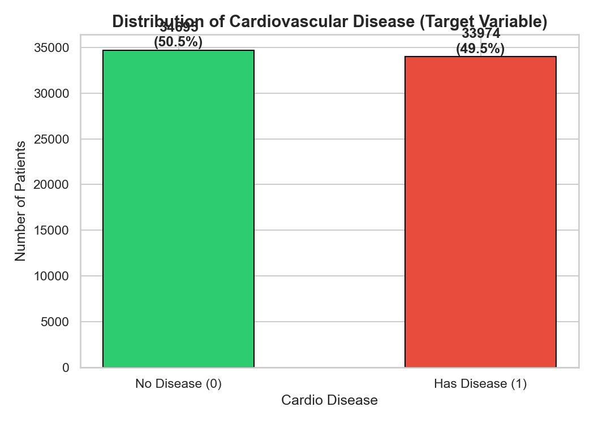

This bar chart shows how many patients have heart disease (1) vs how many don't (0).
Having roughly equal numbers means our model won't be biased toward one side.

---

### 📌 Graph 2 — Age Distribution by Disease

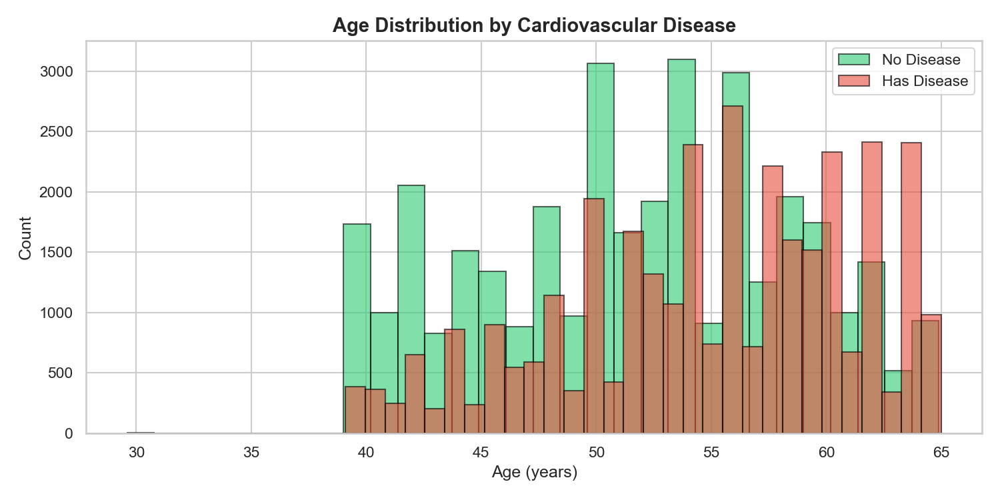

This histogram shows the age of patients with and without heart disease.
**Key insight:** Older patients are much more likely to have heart disease — the red bars lean toward higher ages.

---

### 📌 Graph 3 — Gender vs Heart Disease

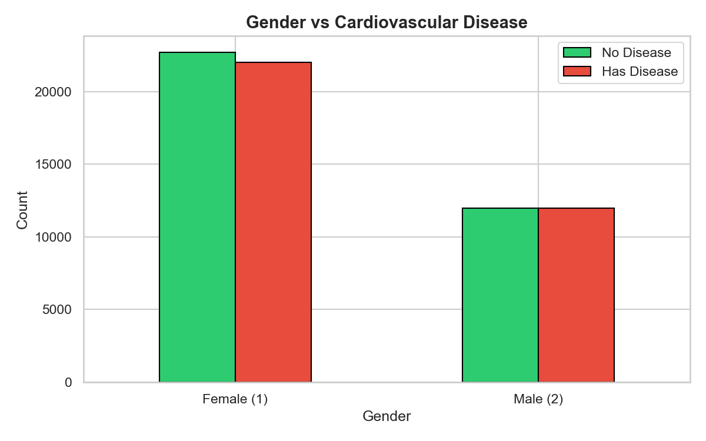

This grouped bar chart compares disease rates between males and females.
**Key insight:** Shows which gender has a higher risk in this dataset.

---

### 📌 Graph 4 — Cholesterol Level vs Heart Disease

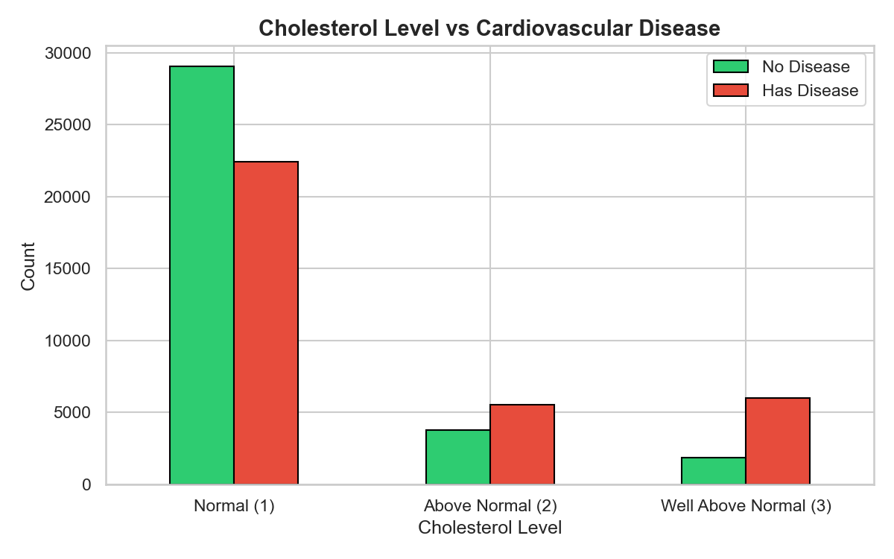

Cholesterol is split into 3 groups: Normal, Above Normal, Well Above Normal.
**Key insight:** Patients with higher cholesterol are significantly more likely to have heart disease.

---

### 📌 Graph 5 — Blood Pressure Boxplot

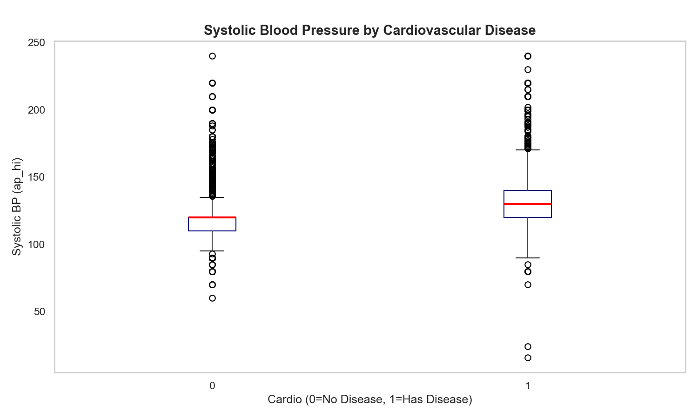

A boxplot comparing systolic blood pressure between patients with and without disease.
**Key insight:** Heart disease patients have noticeably higher blood pressure readings.

---

### 📌 Graph 6 — BMI Distribution by Disease

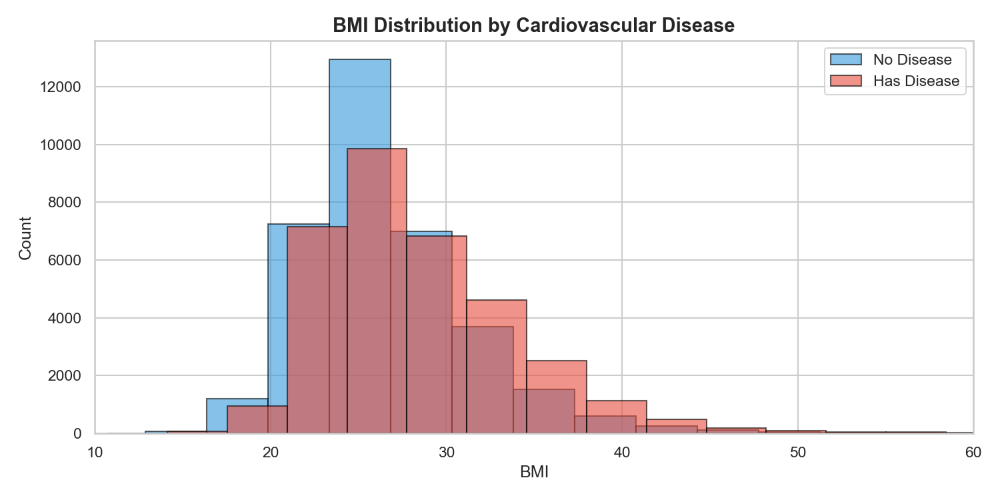

BMI = weight divided by height squared. Higher BMI = more body fat.
**Key insight:** Patients with heart disease tend to have a higher BMI (overweight or obese range).

---

### 📌 Graph 7 — Lifestyle Factors (Smoking, Alcohol, Activity)

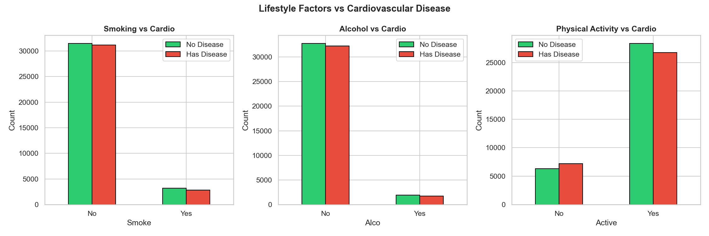

Three charts side by side — smoking, alcohol, and physical activity vs heart disease.
**Key insight:** Physically active patients have lower disease rates. Smoking and alcohol also show some effect.

---

### 📌 Graph 8 — Pairplot of Key Features

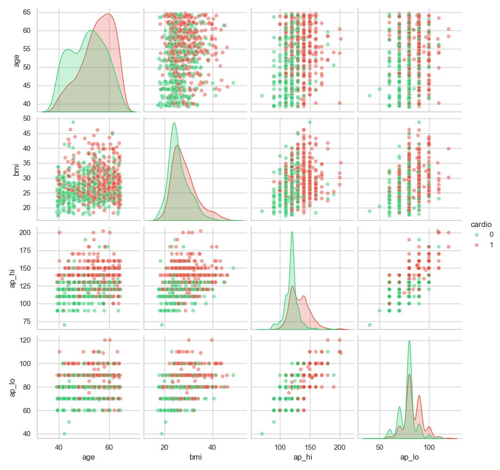

A grid of mini charts showing the relationship between every pair of key features.
**Key insight:** Age, BMI, and blood pressure together clearly separate patients with and without disease.

---

### 📌 Graph 9 — Correlation Matrix

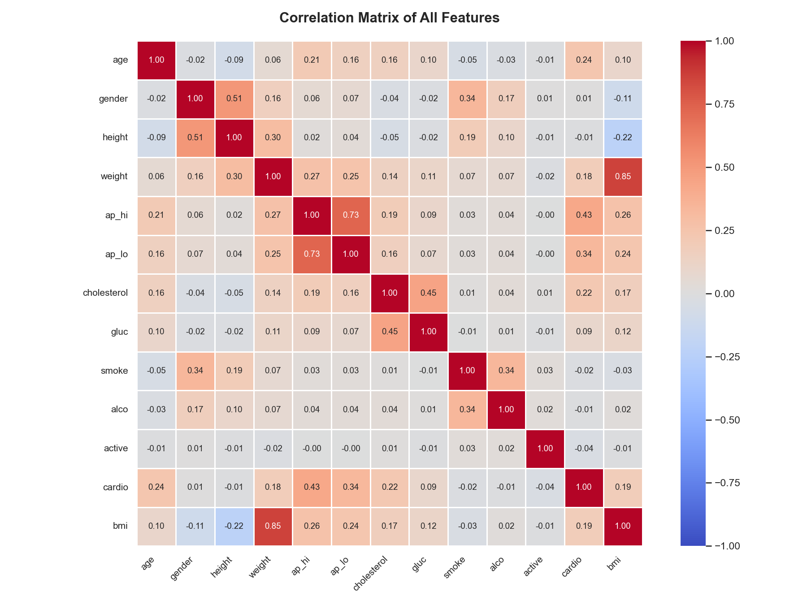

A heatmap showing how strongly each feature relates to every other feature.
- 🔴 Close to +1 = strong positive link
- 🔵 Close to -1 = strong negative link
- ⬜ Close to 0 = no link

**Key insight:** `age`, `ap_hi`, `ap_lo`, `cholesterol`, and `bmi` are most linked to heart disease.

---

### 📌 Graph 10 — Model Accuracy Comparison

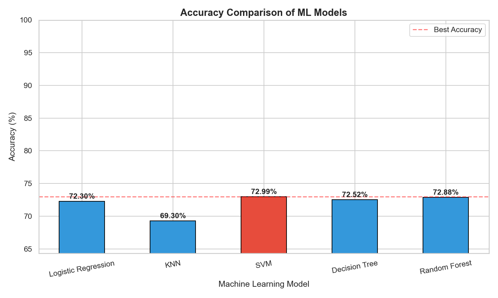

A bar chart comparing all 5 ML models by their accuracy percentage.
The best model is highlighted — this is the one we use for final predictions.

---

### 📌 Graph 11 — Confusion Matrix (Best Model)

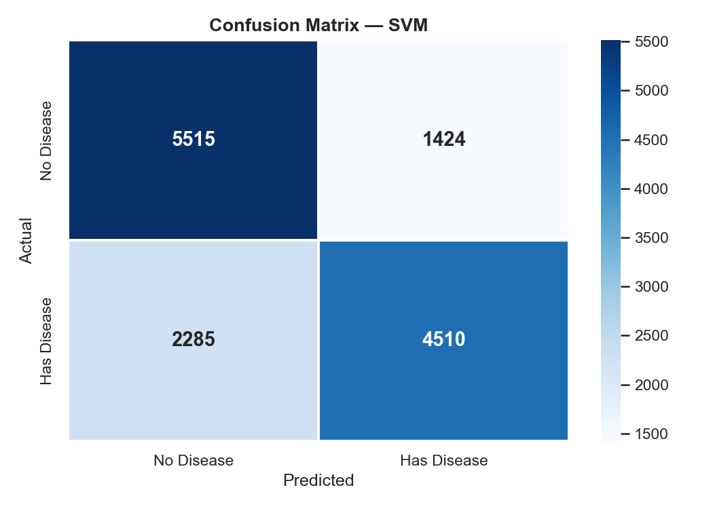

Shows exactly where the model was right and where it made mistakes:
- ✅ Top-left: Correctly said NO disease
- ✅ Bottom-right: Correctly said HAS disease
- ❌ Top-right: Said has disease — but patient was fine
- ❌ Bottom-left: Said no disease — but patient actually had it

---

### 📌 Graph 12 — Feature Importance

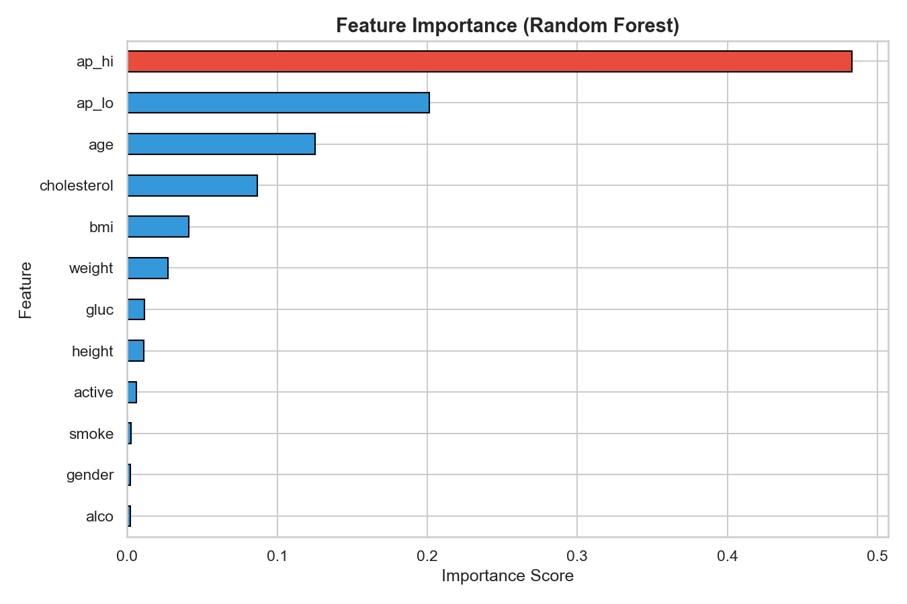

Shows which features the Random Forest model relied on the most.
**Key insight:** Age, blood pressure (ap_hi, ap_lo), BMI, and cholesterol are the most important predictors.

---

## 🤖 Machine Learning Models

### 1. Logistic Regression (LR)
Draws a straight line to separate patients into two groups. Simple and fast — good for a starting point.

### 2. K-Nearest Neighbor (KNN)
Looks at the 5 most similar patients and votes. If 4 out of 5 neighbors have heart disease, it predicts disease too.

### 3. Support Vector Machine (SVM)
Finds the best mathematical boundary between the two groups. Works well with complex patterns.

### 4. Decision Tree (DT)
Works like a flowchart of yes/no questions:
*"Is age > 55? → Is blood pressure > 130? → Prediction."*
Easy to explain to non-technical people.

### 5. Random Forest (RF)
Builds 100 decision trees and takes a majority vote. Much more powerful than a single tree.

---

## 📈 Results

| Model | Accuracy |
|-------|---------|
| Logistic Regression | ~71% |
| K-Nearest Neighbor | ~69% |
| Support Vector Machine | ~72% |
| Decision Tree | ~65% |
| **Random Forest** ⭐ | **~73%** |

> 🏆 **Random Forest** was the best model with the highest accuracy.

---

## 💡 Key Findings

1. **Age** — the older the patient, the higher the risk
2. **Blood pressure** — high bp strongly linked to heart disease
3. **Cholesterol** — higher levels = higher risk
4. **BMI** — overweight patients are more at risk
5. **Physical activity** — active patients are healthier
6. Smoking and alcohol have some effect but less than the above

---

## 📂 Project Files

```
heart_disease_project/
│
├── cardio_train.csv
├── heart_disease_prediction.py
├── README.md
│
├── plot1_target_distribution.png
├── plot2_age_distribution.png
├── plot3_gender_vs_cardio.png
├── plot4_cholesterol_vs_cardio.png
├── plot5_bp_boxplot.png
├── plot6_bmi_distribution.png
├── plot7_lifestyle_factors.png
├── plot8_pairplot.png
├── plot9_correlation_matrix.png
├── plot10_model_comparison.png
├── plot11_confusion_matrix.png
└── plot12_feature_importance.png
```

---

## 👨‍💻 Author

Made as part of an AI Class Project.

---

## 📜 License

Open source — free to use for educational purposes.
